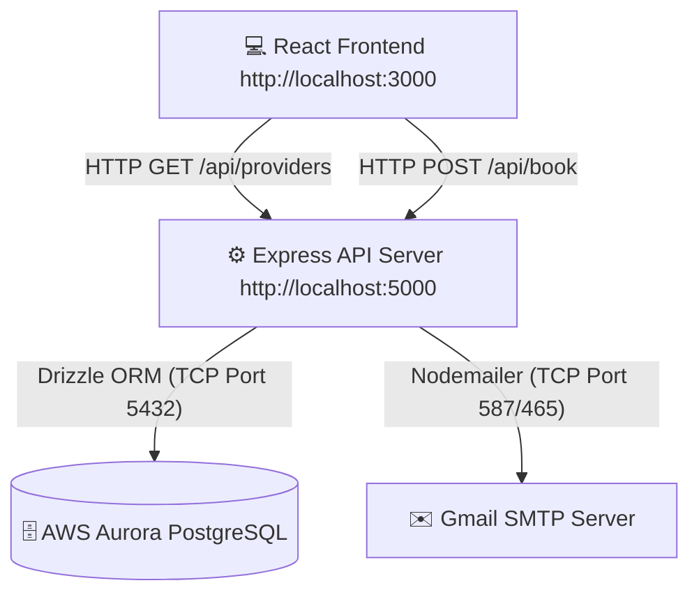

# 🏛️ Local Leads — Complete Architecture & Working Principles

This document explains the complete end-to-end working principles, data flows, and architectural design of the **Local Leads** platform.

---

## 🏗️ 1. High-Level System Architecture

Local Leads is built as a **modern pnpm monorepo** separating the frontend, backend API, shared database definitions, and development automation scripts.



---

## ⚙️ 2. Core Working Principles & Data Flows

### A. The Direct Email & AI Booking Flow (`POST /api/book`)
Instead of relying on external form-forwarding services (like FormSubmit), Local Leads uses a secure, custom-built transactional email pipeline.

```text
[User Submits Booking Form] (home.tsx)
              │
              ▼
[Frontend Fetch Request] ── POST http://localhost:5000/api/book
              │
              ▼
[Express API Endpoint] (book.ts)
              │
              ├─► Validates payload (clientEmail, proName, trade, phone, need)
              └─► Constructs rich HTML transactional email
              │
              ▼
[Nodemailer Transport] ── Connects to smtp.gmail.com using App Password
              │
              ▼
[Direct Notification] ── Dispatches email directly from cmajorbusinessofficial@gmail.com
```

- **Environment Isolation**: The Gmail App Password (`wvdf cqge ndxt ugsx`) is securely injected into the process environment via `start-server.bat` as `EMAIL_PASSWORD`. This prevents hardcoding raw credentials directly in the TypeScript source files.

---

### B. The Live Provider Database Flow (`GET /api/providers`)
The application fetches verified professional profiles dynamically from AWS Aurora in real-time.

```text
[User Visits /providers] (providers.tsx)
              │
              ▼
[React Custom Hooks] (lib/api-client-react)
              │
              ▼
[Express Route Handler] (api-server/src/routes/providers.ts)
              │
              ▼
[Drizzle ORM Query Builder] ── SELECT * FROM providers WHERE ...
              │
              ▼
[AWS Aurora DB Cluster] (TCP Port 5432 over Mobile Hotspot)
```

- **Network Routing Principle**: Because AWS Aurora PostgreSQL communicates strictly on **TCP Port 5432**, local internet connections with strict firewalls (such as university or corporate Wi-Fi) will block outgoing packets, resulting in `ETIMEDOUT` or 500 errors. Using an unmetered cellular connection (Mobile Hotspot) bypasses local port restrictions, guaranteeing a persistent, lightning-fast database connection.

---

## 📂 3. Comprehensive Monorepo Anatomy

```text
C_major/ (Root Monorepo)
 │
 ├── 📦 artifacts/                  
 │    ├── ⚙️ api-server/            [BACKEND CORE]
 │    │    ├── src/routes/          │── Route handlers (book.ts, providers.ts, stats.ts)
 │    │    ├── src/index.ts         │── Main Express server bootstrap & middleware initialization
 │    │    └── build.mjs            └── Esbuild bundler script for compiling TypeScript to dist/
 │    │
 │    └── 🎨 local-leads/           [FRONTEND CORE]
 │         ├── src/components/      │── Shared UI layout, navigation bar, and interactive cards
 │         ├── src/pages/           │── Application Views (home.tsx, providers.tsx, provider-form.tsx)
 │         ├── src/index.css        │── Global Tailwind/Custom CSS declarations
 │         └── vite.config.ts       └── Vite development server configuration (Port 3000)
 │
 ├── 🧩 lib/                        [SHARED PACKAGES]
 │    ├── 🗄️ db/                    │── Drizzle ORM configuration & database connection pooler
 │    │    └── src/schema/          │   └── Table schemas (providers.ts, reviews.ts, portfolio.ts)
 │    │
 │    ├── 📑 api-spec/              │── OpenAPI 3.0 YAML declarations defining API contracts
 │    ├── 🛡️ api-zod/               │── Zod runtime validation schemas for input sanitization
 │    └── 🪝 api-client-react/      └── Auto-generated React Query hooks for type-safe client fetching
 │
 ├── 🛠️ scripts/                    [AWS & DATABASE UTILITIES]
 │    ├── 📜 schema.sql             │── Master DDL script defining tables, indexes, and primary keys
 │    ├── 📜 seed.sql               │── Initial SQL insert statements for seeding pro profiles
 │    └── ⚡ *.bat / *.ps1          └── Utility scripts for applying schema/seeds directly to AWS Aurora
 │
 └── 🚀 Root Batch Files            [EXECUTION LAUNCHERS]
      ├── 🟢 start-server.bat       │── Spawns API backend on Port 5000 + exports Gmail SMTP password
      ├── 🔵 start-client.bat       │── Spawns React frontend on Port 3000
      └── 🔍 check-aws-db.bat       └── Tests TCP connection and ping response to AWS Aurora
```

---

## 🛠️ 4. Subsystem Deep-Dive

### 1. Drizzle ORM & AWS Aurora (`lib/db`)
- **Principle**: Drizzle ORM provides absolute type safety from the database schema up to the React UI. Instead of writing raw SQL strings that can fail at runtime, `lib/db/src/schema` defines TypeScript representations of your Postgres tables.
- **Benefit**: If a column name changes in the database, the TypeScript compiler immediately flags all affected API routes and UI components before the code ever runs.

### 2. Zod & API Contracts (`lib/api-zod` & `lib/api-spec`)
- **Principle**: Never trust client input. Before `api-server` processes any booking request or new provider registration, the incoming JSON payload is passed through `lib/api-zod`.
- **Benefit**: If a user attempts to submit invalid data (e.g., a missing email or malformed phone number), Zod automatically rejects the request with a clean 400 Bad Request error before it touches Nodemailer or AWS Aurora.

### 3. Esbuild & Vite Compilation
- **Principle**: `api-server` uses `esbuild` to transpile TypeScript into native JavaScript modules in milliseconds (`dist/index.mjs`). Meanwhile, `local-leads` utilizes `Vite` for Instant Hot Module Replacement (HMR) during frontend development.

---

## 🎯 5. Quick Troubleshooting Guide

| Symptom | Root Cause | Immediate Resolution |
| :--- | :--- | :--- |
| **500 Error on `/api/providers`** | Network blocking Port 5432 (`ETIMEDOUT`) | Switch laptop connection to Mobile Hotspot & restart `start-server.bat`. |
| **Email fails to send** | Missing `EMAIL_PASSWORD` env variable | Ensure you launch the server using `start-server.bat` rather than raw `pnpm start`. |
| **Git fails with `gitsafe` error** | Legacy corporate Git proxy configuration | Run `git config --unset http.proxy` in terminal to restore direct connection. |
